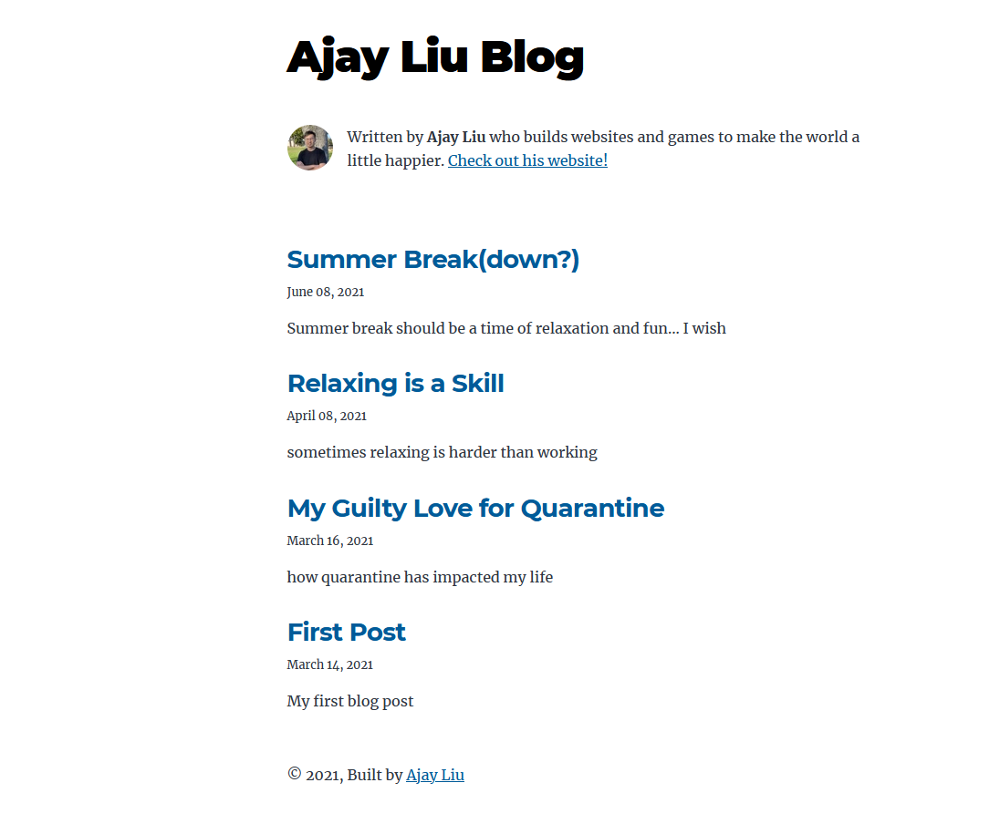

[](https://app.netlify.com/sites/ajayblog/deploys)

<p align="center">
  <a href="https://github.com/AjayLiu/blog">
    
  </a>

  <h3 align="center">Blog</h3>

  <p align="center">
    My personal blog.
    <br />
    <a href="https://blog.ajayliu.com"><strong>Website »</strong></a>
</p>

<!-- TABLE OF CONTENTS -->
<details open="open">
  <summary>Table of Contents</summary>
  <ol>
    <li>
      <a href="#about-the-project">About The Project</a>
      <ul>
        <li><a href="#built-with">Built With</a></li>
      </ul>
    </li>
    <li>
      <a href="#getting-started">Getting Started</a>
      <ul>
        <li><a href="#prerequisites">Prerequisites</a></li>
        <li><a href="#installation">Installation</a></li>
        <li><a href="#development">Development</a></li>
        <li><a href="#adding-new-entries">Adding New Entries</a></li>
      </ul>
    </li>
    <li><a href="#license">License</a></li>
    <li><a href="#contact">Contact</a></li>
    <li><a href="#acknowledgements">Acknowledgements</a></li>
  </ol>
</details>


<!-- ABOUT THE PROJECT -->
## About The Project

</img>

I write down my random thoughts and publish them - somehow it helps me calm down when I feel stressed sometimes. The content is hosted through Netlify CMS.

### Built With
* [Gatsby.js](https://www.gatsbyjs.com/)
* [Netlify CMS](https://www.netlifycms.org/)
* [React](https://reactjs.org/)
* [Netlify](https://www.netlify.com/)


<!-- GETTING STARTED -->
## Getting Started

Here is a guide if you want to clone my website and modify it for yourself, all the way to deployment.

### Prerequisites

* [yarn](https://yarnpkg.com/)
* [git](https://git-scm.com/)

### Installation

1. Clone the repo
   ```sh
   git clone https://github.com/AjayLiu/blog.git
   ```
2. Install packages
   ```sh
   yarn
   ```
3. Publish your site to Netlify using continuous git integration.
4. Enable the 'Identity' feature throught Netlify's dashboard.
5. Set Registration to 'Invite Only'.
6. Enter your own email to invite yourself as admin to your blog (and confirm the email).
7. I recommend enabling External Providers: Google and Github (allows you to login using those).
    
   NOTE: using Login with Google / Login with Github might not work on your development server but will work in deployment. (because it tries to redirect you from your localhost:8000 to the actual site).
8. Make sure Git Gateway is properly set up to link up your repository.

### Development

To run the development server
   ```sh
   yarn start
   ```
  then head over to localhost:8000.
   
### Adding New Entries
1. Go to your-website.com/admin and login using your credentials. Then you will be able to write new blog posts.

<!-- LICENSE -->
## License

Distributed under the MIT License. See `LICENSE` for more information.


<!-- CONTACT -->
## Contact

Ajay Liu - contact@ajayliu.com

Project Link: [https://github.com/AjayLiu/anime-character-quiz](https://github.com/AjayLiu/anime-character-quiz)


<!-- ACKNOWLEDGEMENTS -->
## Acknowledgements
* [This blog's template](https://github.com/gatsbyjs/gatsby-starter-blog.git)
* [Netlify CMS](https://www.netlifycms.org/)
* [Netlify](https://www.netlify.com/)
